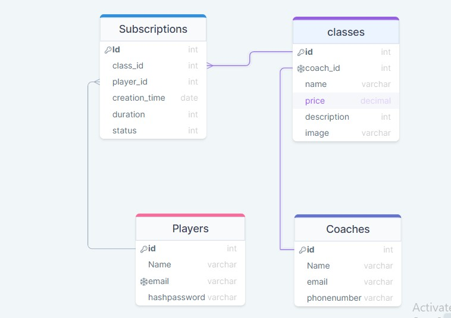

# Fit Life
## Description :
This application will help you improve your health. It allows you to register with sports classes such as yoga and cardio with many qualified trainers.
## Live Page :
- [LIVE LINK](https://fitlifegym.herokuapp.com/)
- [FIGMA](https://www.figma.com/file/NRoX0bLdQBkP1kAwQl2OYe/Fitlife-Gym?node-id=0%3A1)
- [ER Diagram](https://drawsql.app/teams/mohjaps/diagrams/fitgym)
---

## User Story :
- As User , I can view sport classes .
- As User , I can register in Fit-life website .
- As User , I can login in Fit-life website .  
- As User , I can subscribe many classes with qualified trainers .
- As User , I can view all subscribed classes .
- As User , I can display subscribed classes .
- As User , I can logout from website . 

## User journey :
when the user opens the website shows all classes with details of these classes like price and coach and image.to choose his class, he must be login into the website. when I go the view classes page shows all the classes.
when I finish subscribing to classes I can log out. 
---

## Installation :
- If you're a git user :
    in you terminal type : `git clone https://github.com/CA-G12/Fit-life.git `
    then : `cd Fit-life.git`
- If you're not a git user :
  - Click on the 'Code' green button on the right.
  - Click on 'Download ZIP'.
  - You will have the project as ZIP file.
  - Extract the files.

---
## sql ER Diagram :

## Technologies ⚙:
- HTML5
- CSS3
- JS
- NODE.JS
- NPM PACKAGES : Jest , Supertest , Eslint , Node-fetch , express , nodemon , cross-env , pg , faker-js
- JSON files
- GIt & Github
- Heroku

---

## Team members:
- [Mai Elhajeen](https://github.com/Mai-Elhajeen)
- [Salsabeel Al-Najjar](https://github.com/salsabeelomar)
- [Mohammed alshorfa](https://github.com/mohmmed23)
- [Mohammed jaber](https://github.com/mohjaps)